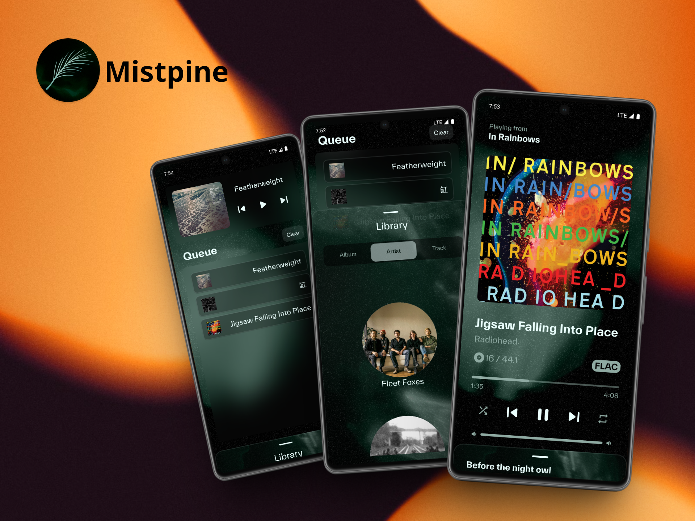
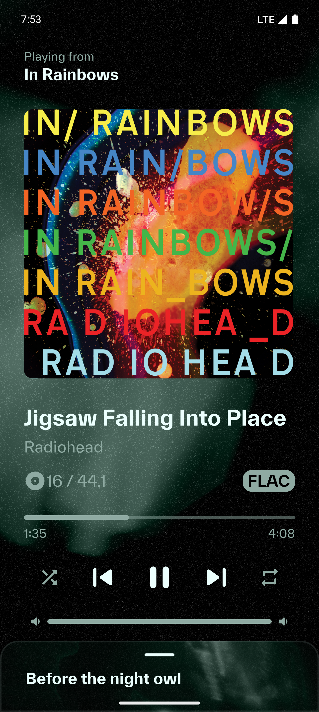
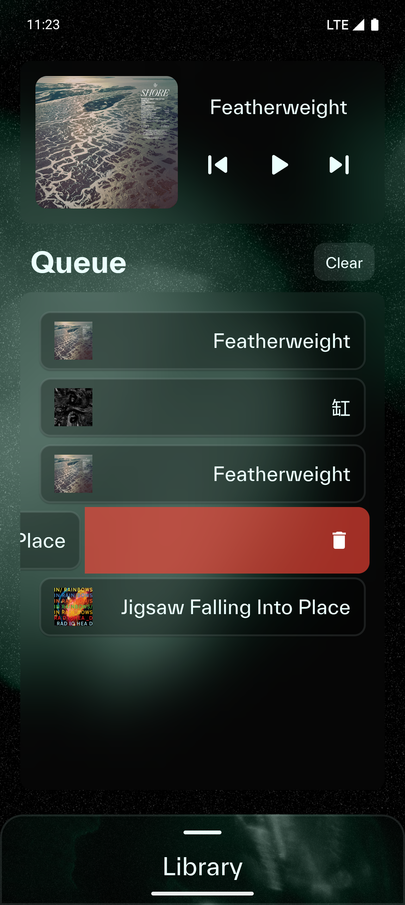
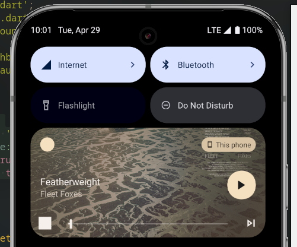

# Mistpine

_Drift into the Stillness of Sound._

**Mistpine** 是一款以佇列管理為主的本地端音樂播放器。播放佇列以直接的方式呈現，讓使用者能隨心所欲的操控播放流程。介面的靈感來自高山被霧氣圍繞松樹林，以單色調和雜訊顆粒帶來寧靜、舒適的氣氛。


## 功能
- 播放音樂
- 播放控制，包含開始、暫停、下一首、上一首、隨機播放、重複播放
- 調整系統音量
- 進度條顯示播放時間，且可以滑動調整

- 能顯示歌詞，並跟著歌曲進度顯示

- 播放器回隨著佇列接續播放，佇列的內容可以調整

- 能再背景播放，也能再通知中心做播放控制

## 安裝

1. 架設 flutter 環境，並將 flutter 加到 PATH。
2. （optional）安裝 android-studio 和設定模擬器。
3. 複製此專案

```
git clone https://github.com/DrifterAldvvyn/Mistpine.git
```

4. 進入專案目錄 

```
cd Mistpine
```

5. 安裝第三方套件（ just_audio, just_audio_background, provider, flutter_volume_controller, lrc, auto_size_text ）

```
flutter pub get
```

6. 啟動模擬器
7. 建置執行

```
flutter run
```
